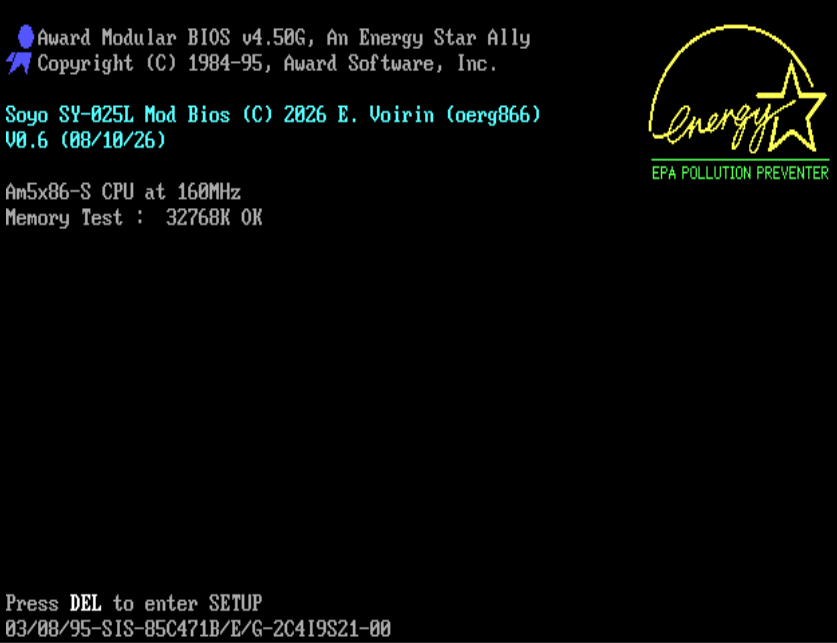
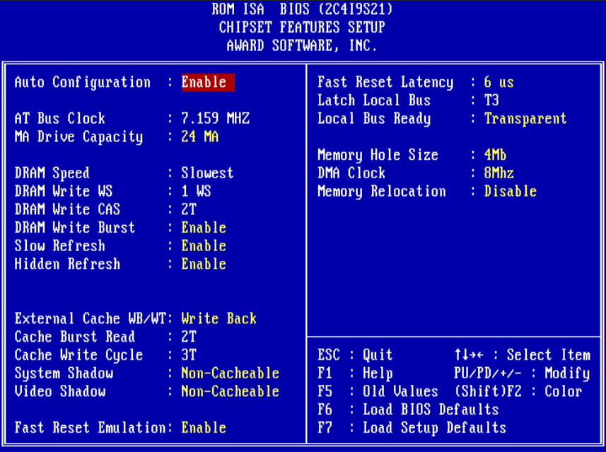
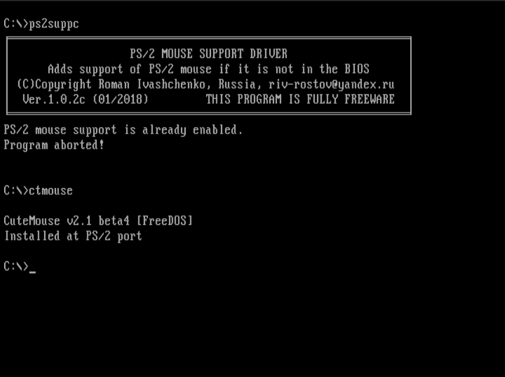

# [SOYO - SY-025J/K/L](https://theretroweb.com/motherboards/s/soyo-sy-025j-k-l)

**BIOS mod by Eric Voirin (oerg866)**

Based on BIOS Revision **G3** (`03/08/95-SIS-85C471B/E/G-2C4I9S21-00`)

## Screenshots

| | | |
|--------------------------|--------------------------|--------------------------|
|  |  |  |

# Changelog
## v0.6a
  - Fix a crash due to the PS/2 Int15h handler
  - Fix Internal Cache WB/WT option being hidden with 5x86 CPUs

## v0.6

- Initial release
- Restored the following BIOS options:
  - CHIPSET FEATURES SETUP / **MA Drive Capacity**
  - CHIPSET FEATURES SETUP / **DRAM Write Burst**
  - CHIPSET FEATURES SETUP / **Slow Refresh**
  - CHIPSET FEATURES SETUP / **Hidden Refresh**
  - CHIPSET FEATURES SETUP / **Internal Cache WB/WT**
  - CHIPSET FEATURES SETUP / **Fast Reset Emulation**
  - CHIPSET FEATURES SETUP / **Fast Reset Latency**
  - CHIPSET FEATURES SETUP / **Latch Local Bus**
  - CHIPSET FEATURES SETUP / **Local Bus Ready**
  - CHIPSET FEATURES SETUP / **Memory Hole Size**
  - CHIPSET FEATURES SETUP / **DMA Clock**
  - CHIPSET FEATURES SETUP / **Memory Relocation**
- Added PS/2 Mouse capability for use with modified KBC circuit
- Added 5x86 support
- Slow EPA Logo fade-out animation removed
- HDD size display bug corrected

## Special Thanks to **Jan Steunebrink** for his invaluable help!
